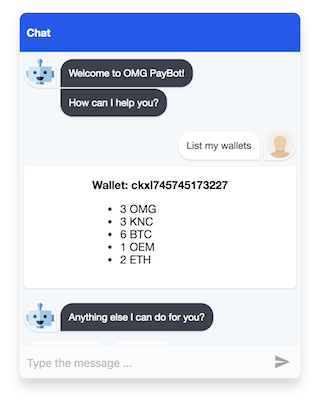

# OMG PayBot
The exercise version of the OMG PayBot workshop sample app.

The workshop slides can be found at [ewallet-workshop.pdf](ewallet-workshop.pdf).

This exercise is built with React Simple Chatbot. Learn more at [LucasBassetti/react-simple-chatbot](https://github.com/LucasBassetti/react-simple-chatbot).



## Prerequisites

Setup the eWallet server locally following instructions [here](https://github.com/omisego/ewallet#getting-started).

Then start it using:

```
$ ENABLE_STANDALONE=true \
  BASE_URL=http://localhost:4000 \
  REDIRECT_URL_PREFIXES=http://localhost:3000 \
  CORS_ORIGIN=http://localhost:3000 \
  mix omg.server
```

The URL `http://localhost:3000` should point to the address where your OMG PayBot will be served from.

## Setup

1. Install node (https://nodejs.org/en/download) and yarn (https://yarnpkg.com/en/docs/install)

2. Install yarn dependencies

```
$ yarn install
```

3. Duplicate `src/configSample.js` to `src/config.js` and update the configuration for your setup.

```
$ cp src/configSample.js src/config.js
```

The `apiKey` can be retrieved from the [admin panel](http://localhost:4000/admin). Login and navigate to the `API` section, then generate a new client API or take an existing one.

4. Start the server

```
$ yarn start
```

5. Your task, if you choose to accept, is to complete this chatbot by using the right endpoints and passing the correct key/values to the request header and body. Good luck!
